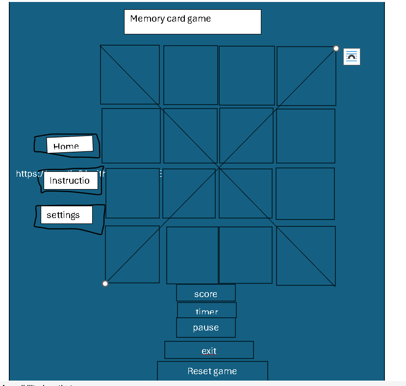
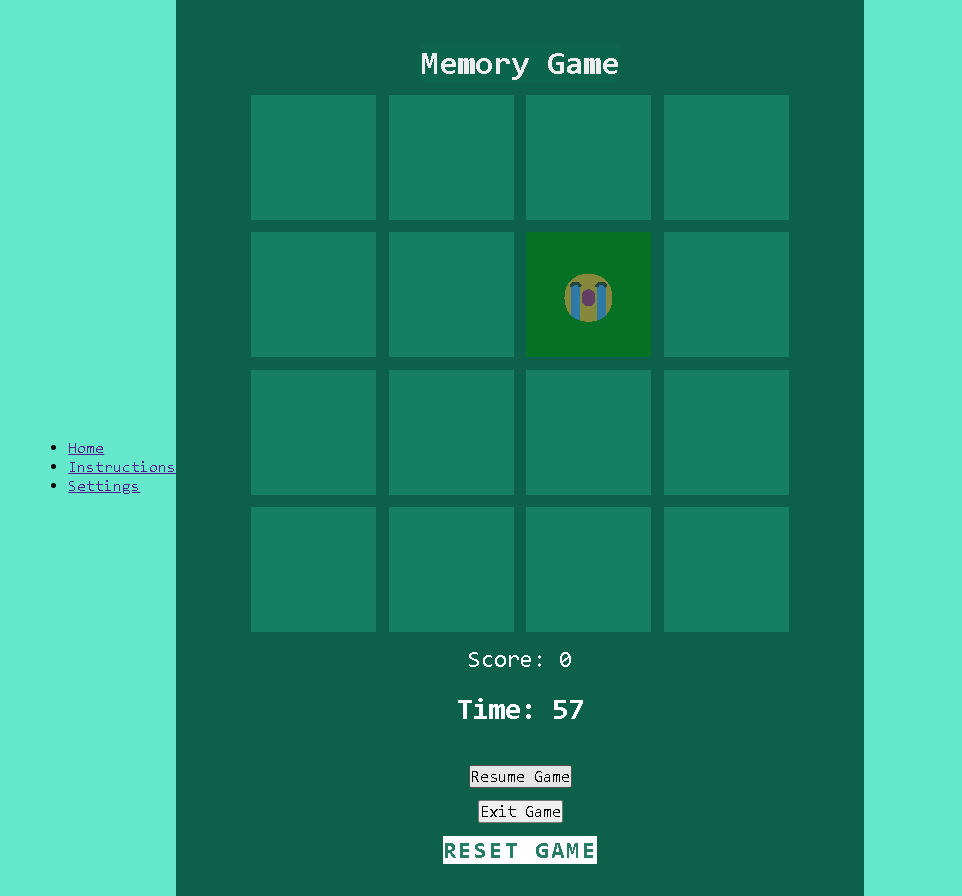
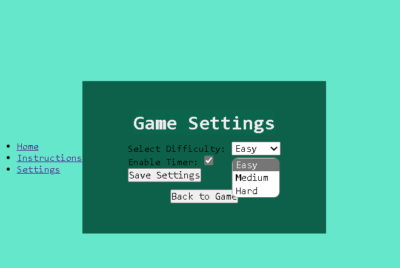
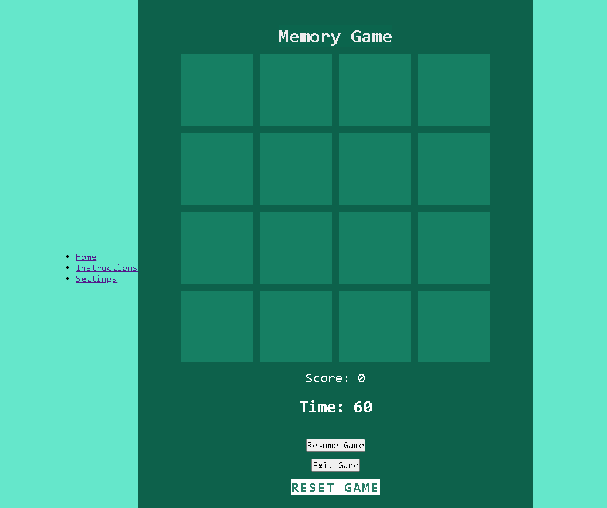
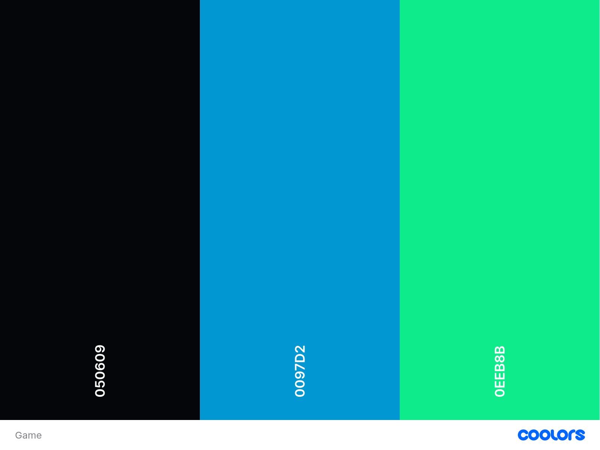

# 

Click here to access the game.https://apostle01.github.io/HEYDEN/

---

# Memory Cards

-[A game designed to test your memory. Can you correctly recall the order of a shuffled deck of cards?]

# Memory Game

Welcome to the Memory Game! This is a fun and engaging game built using HTML, CSS, and JavaScript. The objective of the game is to match all pairs of cards with the same emoji within the allotted time. 

## Table of Contents

- [Features](#features)
- [Getting Started](#getting-started)
- [Game Instructions](#game-instructions)
- [Settings](#settings)
- [Accessibility](#accessibility)
- [Wireframe](#wireframe)
- [Screenshots](#screenshots)
- [Technologies Used](#technologies-used)
- [Contributing](#contributing)
- [License](#license)
- [Contact](#contact)

## Features

- **Responsive Design**: The game is responsive and works well on different devices.
- **Pause and Resume**: You can pause and resume the game at any time.
- **Settings**: Customize the game settings according to your preferences.
- **Score and Timer**: Displays the current score and the remaining time.
- **Accessible**: The game meets accessibility guidelines for a better user experience.

## Getting Started

### Prerequisites

- A modern web browser (e.g., Chrome, Firefox, Edge, Safari)

### Installation

1. Clone the repository:

    ```sh
    git clone https://github.com/Apostl01/Heyden.git
    ```

2. Navigate to the project directory:

    ```sh
    cd memory-game
    ```

3. Open `index.html` in your preferred web browser.

## Game Instructions
https://apostle01.github.io/HEYDEN/instructions.html

1. Click on a card to reveal the emoji.
2. Click on another card to find the matching emoji.
3. If the emojis match, the cards will stay revealed. If they don't, both cards will be hidden again.
4. The game ends when all pairs are matched or the timer runs out.
5. Your final score will be displayed at the end of the game.

## Settings
https://apostle01.github.io/HEYDEN/settings.html

The settings page allows you to customize the game:

- **Difficulty Level**: Adjust the number of card pairs and the time limit.

## Accessibility

- **Keyboard Navigation**: You can navigate the game using the keyboard.
- **Screen Reader Support**: The game is compatible with screen readers.

## Wireframe



### Main Page
- A header with navigation links to Home, Instructions, and Settings.
- A game container with cards, score display, timer, pause, and exit buttons.

### Settings Page
- Options to select difficulty level and theme.

## Screenshots

### Main Game Screen


### Settings Page


## Technologies Used

- **HTML5**: Structure of the game.
- **CSS3**: Styling and layout.
- **JavaScript**: Game logic and interactivity.

## Contributing

1. Fork the repository.
2. Create your feature branch (`git checkout -b feature/AmazingFeature`).
3. Commit your changes (`git commit -m 'Add some AmazingFeature'`).
4. Push to the branch (`git push origin feature/AmazingFeature`).
5. Open a Pull Request.

## License

Distributed under the MIT License. See `LICENSE` for more information.




[Click here to access the site](https://Apostle01.github.io/Heyden/)


---

## Table Of Contents

## Project Goals

### User Goals
- A website that is easy to navigate.
- A website that will display well on different devices.
- A description of how to play the game.
- Contact information of the developer.
- Positive and immediate feedback from the site such as on hover or on click JavaScript animations to ensure a good user experience.

### Site Owner Goals
- Provide a fun memory game with a lot of replayability potential.
- Allow different difficulty settings.
- Display the game in a good looking and engaging manner to appeal to the user.
- A game that is responsive and works well on mobiles as well as desktops.

### Developer Goals
- A well designed website that catches the attention of the users.
- A responsive website where the functionality is not impacted by screen size.
- Easy navigation that is intuitive and responsive.
- A website designed with accessibility in mind.
- A finished product that will proudly be displayed within the developer's portfolio.

## User Stories

### First Time Visitor Goals
1. As a First Time Visitor, I want to know the purpose of the website immediately.
2. As a First Time Visitor, I want to be able to navigate the website easily and intuitively.
3. As a First Time Visitor, I want to be able to learn how to play the game.
4. As a First Time Visitor, I want to know if my individual guesses are correct.
5. As a First Time Visitor, I want to know my final score.

### Returning Visitor Goals
6. As a Returning Visitor, I want to be able to quickly play the game.
7. As a Returning Visitor, I want to be able to contact the website developer.
8. As a Returning Visitor, I want to be able to reset the game at any point.
9. As a Returning Visitor, I want the game to prevent me entering invalid guesses.

### Frequent Visitor Goals
10. As a Frequent Visitor, I want to be able to tune the difficulty of the game.
11. As a Frequent Visitor, I want to be able to see other work from the developer.
12. As a Frequent Visitor, I want to be able to see my chosen sequence length after the game starts.
13. As a Frequent Visitor, I want to be able to play the game on different devices.


#### Viability and Feasibility
Followed is an analysis of the above user and business needs ranked from 1 (least important/viable) to 5 (most important/viable):
| Task                                        | Importance | Viability/Feasibility |
| ------------------------------------------- | ---------- | --------------------- |
| Card Memory Game                            | 5          | 5                     |
| A way to give feedback to the developer     | 5          | 5                     |
| Responsive on all devices                   | 5          | 5                     |
| Different difficulties                      | 3          | 5                     |
| 404 page                                    | 4          | 4                     |
| How to play                                 | 3          | 4                     |
| Link to developer GitHub                    | 2          | 5                     |
| A reset button                              | 3          | 3                     |
| Knowing if individual answers are correct   | 3          | 3                     |
| Knowing the final score                     | 5          | 5                     |
| Preventing the user entering invalid values | 5          | 3                     |
| A way to tune the difficult of the game     | 3          | 5                     |

Based on the above assessment, all the tasks look to be implementable.

### Scope

#### Content Requirements
A mobile-first approach is taken to ensure optimal performance on mobile devices and the Bootstrap 5 size limits will be considered during the design of each section in order to make it suitable for phones, tablets, and desktops.

##### Section: Navigation Bar
- The navigation bar will be present on every page to create a cohesive structure across the website.
- It will include the site name and logo, so that the website is easily identifiable.
- It will have links to the homepage, how to play page, and contact me page.
- The links will be responsive to a mouse hover and click to provide feedback to the user.
- The current page will have its link identified in some way to indicate the current page.

##### Section: Footer
- The footer section will be present on every page to create a cohesive structure across the website.
- It will include the site name and logo, so that the website is easily identifiable.
- It will include external links such as a link to the developer's GitHub profile.
- External links will be responsive to a mouse hover and click to provide feedback to the user.
- External links will open in a new tab to provide good user experience.

##### Webpage: Homepage
- The homepage will house the memory game.

##### Webpage: How to play
- The how to play page will provide instructions to the user.

##### Webpage: Contact me
- The contact me page will house a text box, allowing the user to send a message to the developer's email using an API.

### Structure

#### Overall Structure
Each page will consist of:
- **Navigation bar**: Meets the navigation requirement.
- **Main section**: Meeting the page-specific requirements.

Required pages and their main sections:
- **Homepage**: This page will meet the requirement for an interactive game.
    1. The main section of the homepage will hold the game area.
    2. The game area will have the following functionality:
        - The user can select a number of cards to memorise.
        - The cards will then be shuffled.
        - The shuffled cards will be displayed to the user.
        - The amount of shuffled cards will be displayed to the user.
        - The shuffled cards will then be hidden and the user must recreate the sequence.
        - The user will be informed of their final score.
- **How to play**
        - Click on a card to flip it over and reveal    its   symbol.
        Click on a second card to flip it over and reveal its symbol.
        If the two cards match, they remain face-up.
        If the two cards do not match, they are flipped back face-down after a short delay.
         Continue flipping cards to find all the matching pairs.
        The game ends when all pairs are found and all cards are face-up.

#### Information Architecture
The same navigation bar and footer will be implemented on each page to create a consistent website that is pleasing to look at and easy to use.
The navigation bar will have the site brand/logo that links to the homepage as well as separate links to the other pages. This will allow the user to access the desired section of the site well within the 3 click maximum that many websites adhere to.
There will be no sub-category navigation links within each webpage.

#### Interactive Experience
- **The website**: Clickable links will have animated effects on hover or click, providing clear feedback to the user. All external links such as the GitHub profile will open in a new tab. Content hinting will be used where possible to influence the user to scroll down and uncover new content on the pages.
- **The game**: 
    - The game will work by firstly having the user select the level of expectise. 
    - When settings button is clicked, the user will then choose their level from 3 different levels.
    - Click on Reset button to begin the game.
    - There will be feedback on score and congratulations message.

#### Changes during development
The decision was taken to after reviews from tutor. So I added an instruction and settings page to help change it from just a 0ne page website.

### Surface

#### Colour Scheme



As can be seen the chosen colours provide adequate contrast in line with the accessibility criteria for the webpage. The chosen colours are:


#### Typography
I researched clear legible typefaces that will enhance the user experience of the site and picked one for the navigation bar and titles, one for the button and table text, and one for blocks of text. They were used in this regard across the website to acheive a consistent brand.

#### Images


#### How To Play

- Clicking the how to play link in the header opens up the how to play modal.
- It is bordered in the shape of a playing card to continue the theme of the game.
- It has the inverted colour scheme to the how to play link, relating them in the user's mind.
- It provides the user with information on how to play the game in a concise and fun way.

## Technologies Used

### Frameworks
1. [Bootstrap v5.3.3](https://getbootstrap.com/)
	* CSS library used for its grid system and easier styling and responsiveness 
2. [jQuery](https://jquery.com/)
    * JavaScript library used for concise ways to grab elements from the DOM

### Tools
1. [Visual Studio Code](https://code.visualstudio.com/)
    * This is my IDE of choice for writing my HTML, CSS, and JavaScript code for this project
2. [Git](https://git-scm.com/)
	* Used for version control
3. [GitHub](https://github.com/)
	* Used to store the code

## Testing
For the website testing, please see the separate [TESTING.md](/TESTING.md) file.

### Wave testing
 -[Settings Page](docs/Wave1.png)
- Clicking or typing this link into your URL bar will take you to your deployed website. Congratulations! You can then manually test the functionality of your website following along with my [TESTING.md](/TESTING.md) procedure.

- For any troubleshooting advice, the guys over at GitHub have provided handy documentation that can be found [here](https://docs.github.com/en/pages/quickstart).

### Forking The Repository
This repository can be forked, allowing you to create a separate codebase to make local changes without impacting the original repository. <br>
You can fork the repository if you have a [GitHub](https://github.com/) account by going the [GitHub repository](https://github.com/amfairley/memorycards) and selecting **Fork** in the top right corner and click **+ Create a new fork**. This will take you to a new page where you can assign yourself as an owner, add a description, and fork the main page.
<details><summary>Fork location image</summary>

</details>

For any troubleshooting, see the GitHub documentation that can be found [here](https://docs.github.com/en/pull-requests/collaborating-with-pull-requests/working-with-forks/fork-a-repo).

### Deploying Locally

To deploy locally; you can clone this repository. To do so, access the [GitHub Repository](https://github.com/Apostle01/Heyden) and click on the bright green "<> Code" button located below the Pin/Watch/Fork/Star toolbar and above the repository file list. From here, select your required option; either cloning it from the web URL using HTTPS, using a password protected SSH key using SSH, or working in the offial GitHub CLI with GitHub CLI. Then use the IDE of your choice, (mine is [Visual Studio Code](https://code.visualstudio.com/)) to clone it.
<br>For example, in Studio Visual Code you will need to use the git clone command as such:<br>

```
git clone https://github.com/Apostle01/Heyden.git
```

There is also the option in the same green "<> Code" button to download all files as a ZIP folder or open the repository with GitHub Desktop.
For any troubleshooting, please see the GitHub documentation that can be found [here](https://docs.github.com/en/repositories/creating-and-managing-repositories/cloning-a-repository).


## Credits

### Media
Youtube videos

## Acknowledgements
- [Code Institute](https://codeinstitute.net/global/) Slack community members for their support and help
- My fellow [Code Institute](https://codeinstitute.net/global/) learning cohort for all of their advice and support
- My friends, tutor, and colleagues who provided essential user tests to get the game to the state it is in today